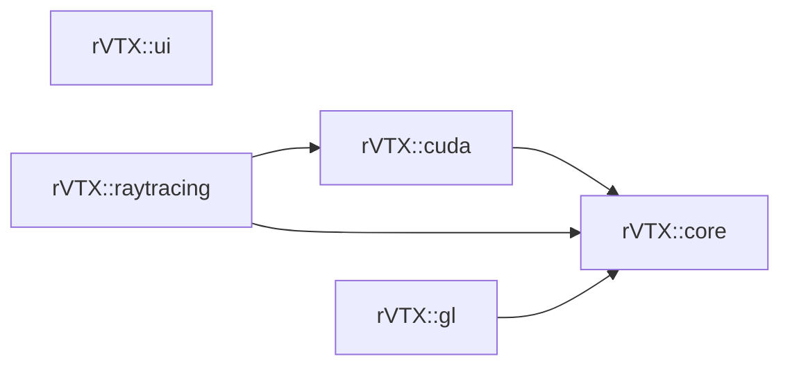

# How to contribute?

## How to commit?
Contributing to the project can be done in different ways : 
- **fixes**: fixes include general bug fixes, refactoring of a function or performance improvements. Your commit should be prefixed with the corresponding change (`fix:`, `refactor:`, or `perf:`).
- **features**: you just added a new feature, without introducing **breaking** changes, your commit must be prefixed by `feature:`.
- Any change that is **BREAKING** (it changes how a function behaves completly, changing the output result, for instance) must be prefixed by `[BREAKING]` in the commit title.
- **readme**: your changes only envolve project documentation modification.
 
Don't use the master branch directly when making changes: create an appropriatly named branch to work in. Once the changes have been made make sure they respect the following guidelines:
 - Any fixes of features must be tested so that it **works**, respects [cross-platform guidelines](#cross-platform-guidelines), [naming conventions](#naming-conventions) and (if you can) adds comments explaining how complex things are working in your code, and/or example usages. 
- There is a `.clang-format` for the project, please format your code before commiting anything. (`Ctrl+K, Ctrl+D` on Visual Studio for instance).

Once this is done, you can create a pull-request (PR) with a brief description of the changes so that the code is analyzed and discussed by the others.

## Cross-platform guidelines

Be wary that while this library mainly targets Windows, we want it to be as cross-platform as possible. All platform-specific (e.g. pthread) code must be correctly bounded by a dedicated macro and avoided as possible. Additionally `rVTX::core` should respect the previous rule as strictly as possible, as it contains general API, OS and vendor-agnostic classes.

### Naming conventions
Here are the conventions when contributing files and code to the project :
- File names must be lowercase (snake_case) versions of the class name, using underscores '_' where you would naturally put spaces (example: `RenderTarget`  &rarr;  `render_target.hpp`)
- Header files must have `.hpp` extension and contain header guards (not `#pragma once`). The header guard must correspond to the hierarchy of the file, for instance: `gl/core/render_target.hpp` will have header guard `#ifndef RVTX_GL_CORE_RENDER_TARGET_HPP`.
- Inline and template functions must not be put in the header file, but in its own inline `.inl` file next to the `.hpp`.
- Functions and variables are written using lowerCamelCase, private variables with an `m_` prefix (example: `m_cameraTarget`).
- Classes and structs are written using UpperCamelCase.
- Namespaces must be written using snake_case
- Use namespaces only when it makes sense. Modules are each in their namespace but avoid excessive namespace (do not do: `namespace rvtx::gl::math::linear_algebra`, for instance).

Example usage of the conventions :

```cpp
// File : 'gl/core/example_class.hpp'

#ifndef RVTX_GL_CORE_EXAMPLE_CLASS_HPP
#define RVTX_GL_CORE_EXAMPLE_CLASS_HPP

#include  <glm/vec3.hpp>

namespace  rvtx::gl
{
    class  ExampleClass
    {
        public:
            ExampleClass();
            
            void  complexFunction();
            inline  glm::vec3  getVec3Variable();
            
        private:
            glm::vec3 m_vec3Variable;
    }
} // namespace rvtx::gl

#include  "rvtx/gl/core/example_class.inl"

#endif // RVTX_GL_CORE_EXAMPLE_CLASS_HPP
```
```cpp
// File : 'gl/core/example_class.inline'

#include  "rvtx/gl/core/example_class.hpp"

namespace  rvtx::gl
{
    inline  glm::vec3 ExampleClass::getVec3Variable() { return m_vec3Variable; }
} // namespace rvtx::gl
```
```cpp
// File : 'gl/core/example_class.hpp'

#include  "rvtx/gl/core/example_class.hpp"

namespace  rvtx::gl
{
    ExampleClass::ExampleClass()
    {
        // Init some stuffs...
    }

    void ExampleClass::complexFunction()
    {
        // Do something...
    }
} // namespace rvtx::gl
```
### Where to add files and extern libraries?

- When adding files, put them in subdirectories based on their function, for instance, in the `core` module, the `ux` folder contains files related to user experience (input, camera controllers, etc).
- The `CMakeLists.txt` are organized in the following way :
    - The root folder (`rVTX/`) contains the general `CMakeLists.txt` that will be included in your project. The root folder also contains each module's folder and an `extern` folder, containing libraries shared between at least two modules.
    - Each module has its own `CMakeLists.txt`, containing the sources and includes of this module. Each module has its own `extern` folder with libraries used only by this specific module.
    - Don't forget to add your source and header file to the corresponding `CMakeLists.txt`!
- Here is the current dependency graph of the modules :

